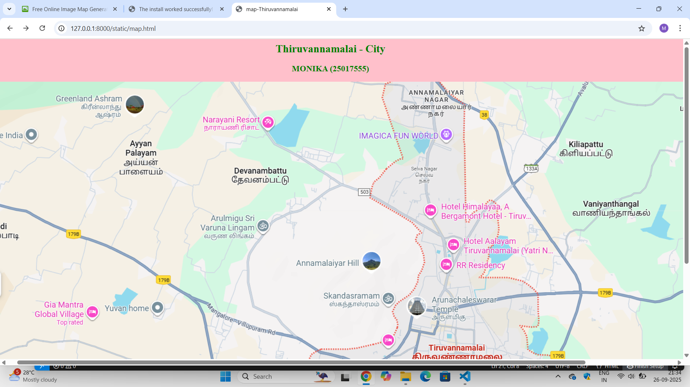
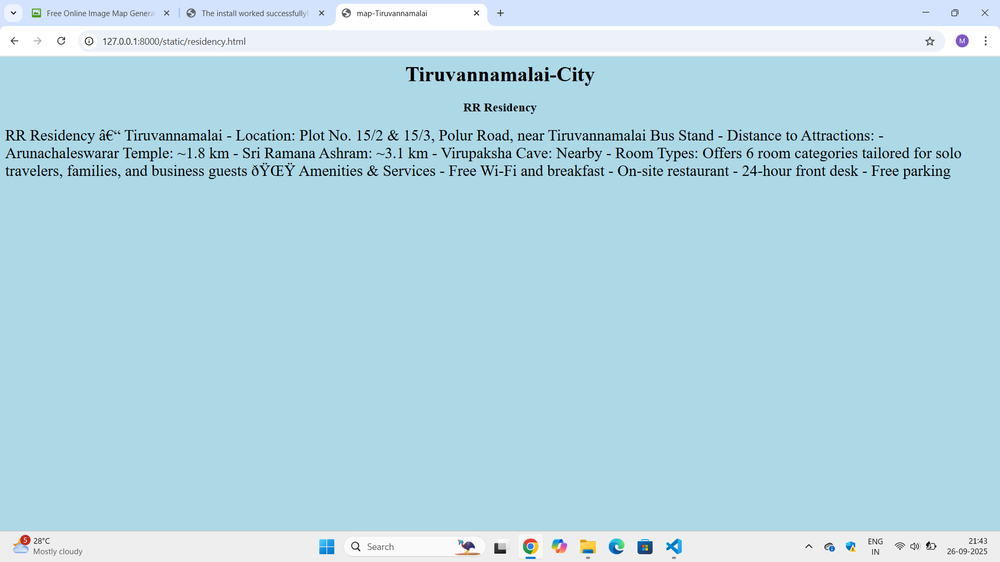
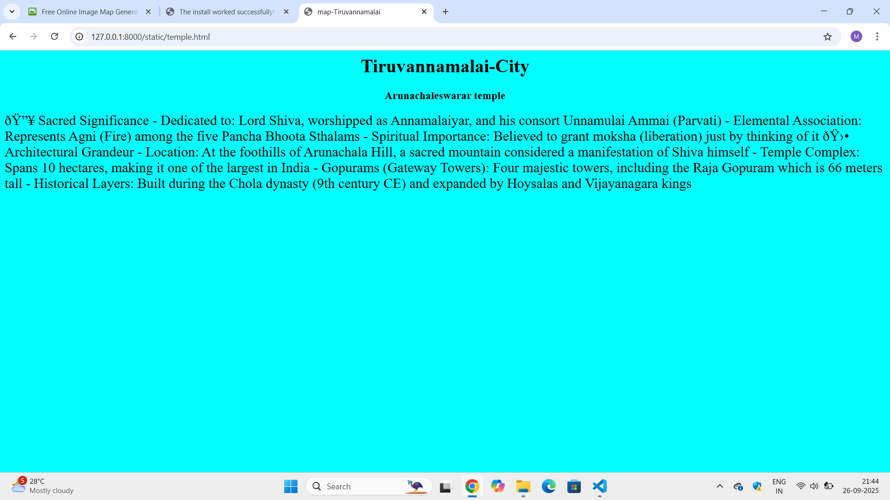
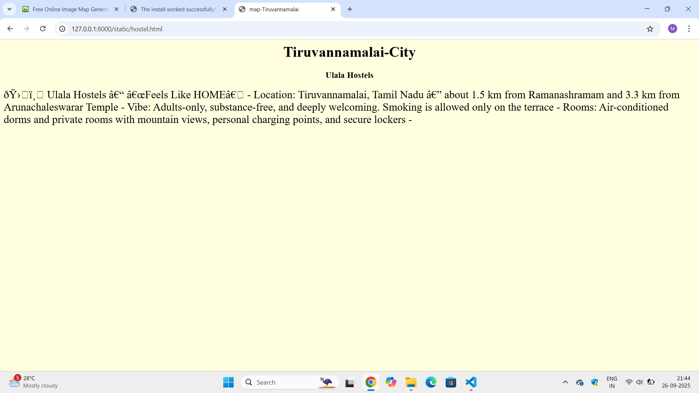
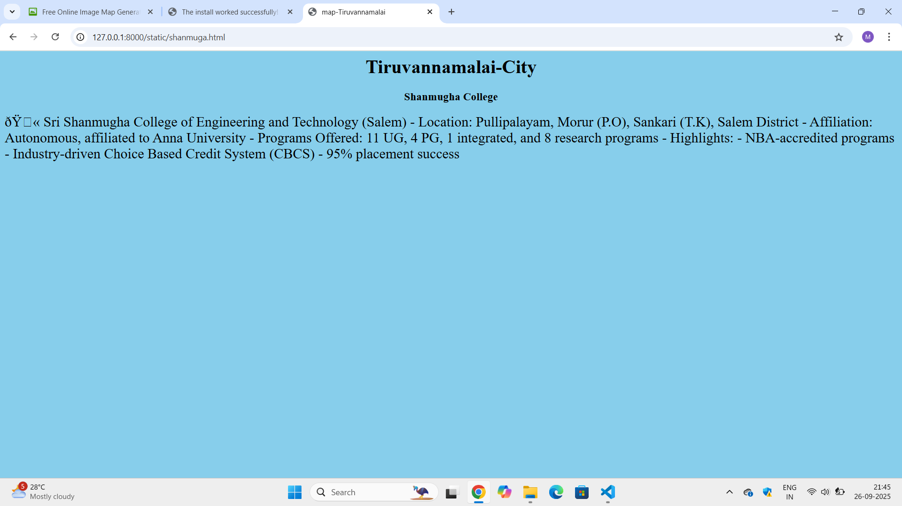
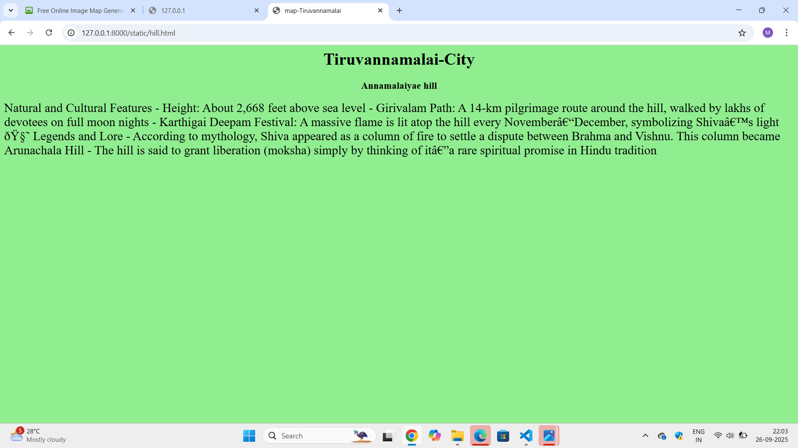

# Ex04 Places Around Me
## Date: 26.09.2025

## AIM
To develop a website to display details about the places around my house.

## DESIGN STEPS

### STEP 1
Create a Django admin interface.

### STEP 2
Download your city map from Google.

### STEP 3
Using ```<map>``` tag name the map.

### STEP 4
Create clickable regions in the image using ```<area>``` tag.

### STEP 5
Write HTML programs for all the regions identified.

### STEP 6
Execute the programs and publish them.

## CODE
```
<html>
    <head>
        <title>
            map-Thiruvannamalai
        </title>
        <link rel="stylesheet" href="style.css">
    </head>
    <body bgcolor="pink">
        <h2 align="center">Thiruvannamalai - City</h2>
        <h3 align="center">MONIKA (25017555)</h3>
    

<map name="image-map">
    <area target="" alt="Shanmuga college" title="Shanmuga college" href="shanmuga.html" coords="963,706,1201,740" shape="rect">
    <area target="" alt="Annamalaiyar temple" title="Annamalaiyar temple" href="hill.html" coords="803,366,874,365,878,424,807,424" shape="poly">
    <area target="" alt="Ulala Hostels" title="Ulala Hostels" href="hostel.html" coords="773,708,26" shape="circle">
    <area target="" alt="RR Residency" title="RR Residency" href="residency.html" coords="984,395,1032,387,1032,420,988,435" shape="poly">
    <area target="" alt="Arunachaleswarar  temple" title="Arunachaleswarar  temple" href="temple.html" coords="918,484,975,478,965,525,914,525" shape="poly">
</map>

</body>
</html>
<html>
    <head>
        <title>map-Tiruvannamalai</title>
    </head>
    <body bgcolor="lightgreen">
        <h1 align="center">Tiruvannamalai-City</h1>
        <h3 align="center">Annamalaiyae hill </h3>
        <p>
            <font size="5">
                 Natural and Cultural Features
- Height: About 2,668 feet above sea level
- Girivalam Path: A 14-km pilgrimage route around the hill, walked by lakhs of devotees on full moon nights
- Karthigai Deepam Festival: A massive flame is lit atop the hill every November–December, symbolizing Shiva’s light

🧘 Legends and Lore
- According to mythology, Shiva appeared as a column of fire to settle a dispute between Brahma and Vishnu. This column became Arunachala Hill
- The hill is said to grant liberation (moksha) simply by thinking of it—a rare spiritual promise in Hindu tradition
            </font>
        </p>
    </body>
</html>
<html>
    <head>
        <title>map-Tiruvannamalai</title>
    </head>
    <body bgcolor="lightyellow">
        <h1 align="center">Tiruvannamalai-City</h1>
        <h3 align="center">Ulala Hostels</h3>
        <p>
            <font size="5">
                🛏️ Ulala Hostels – “Feels Like HOME”
- Location: Tiruvannamalai, Tamil Nadu — about 1.5 km from Ramanashramam and 3.3 km from Arunachaleswarar Temple
- Vibe: Adults-only, substance-free, and deeply welcoming. Smoking is allowed only on the terrace
- Rooms: Air-conditioned dorms and private rooms with mountain views, personal charging points, and secure lockers
- 

              </font>
        </p>
    </body>
    </html>

    <html>
    <head>
        <title align="center">map-Tiruvannamalai</title>
    </head>
    <body bgcolor="lightblue">
        <h1 align="center">Tiruvannamalai-City</h1>
        <h3 align="center"> RR Residency </h3>
        <p>
            <font size="5">
                 RR Residency – Tiruvannamalai
- Location: Plot No. 15/2 & 15/3, Polur Road, near Tiruvannamalai Bus Stand
- Distance to Attractions:
- Arunachaleswarar Temple: ~1.8 km
- Sri Ramana Ashram: ~3.1 km
- Virupaksha Cave: Nearby
- Room Types: Offers 6 room categories tailored for solo travelers, families, and business guests

🌟 Amenities & Services
- Free Wi-Fi and breakfast
- On-site restaurant
- 24-hour front desk
- Free parking

            </font>
        </p>
    </body>
</html>

<html>
    <head>
        <title>map-Tiruvannamalai</title>
    </head>
    <body bgcolor="skyblue">
        <h1 align="center">Tiruvannamalai-City</h1>
        <h3 align="center">Shanmugha College</h3>
        <p>
            <font size="5">

                🏫 Sri Shanmugha College of Engineering and Technology (Salem)
- Location: Pullipalayam, Morur (P.O), Sankari (T.K), Salem District
- Affiliation: Autonomous, affiliated to Anna University
- Programs Offered: 11 UG, 4 PG, 1 integrated, and 8 research programs
- Highlights:
- NBA-accredited programs
- Industry-driven Choice Based Credit System (CBCS)
- 95% placement success

            </font>
        </p>
    </body>
</html>

<html>
    <head>
        <title>map-Tiruvannamalai</title>
    </head>
    <body bgcolor="cyan">
        <h1 align="center">Tiruvannamalai-City</h1>
        <h3 align="center">Arunachaleswarar temple</h3>
        <p>
            <font size="5">
              🔥 Sacred Significance
- Dedicated to: Lord Shiva, worshipped as Annamalaiyar, and his consort Unnamulai Ammai (Parvati)
- Elemental Association: Represents Agni (Fire) among the five Pancha Bhoota Sthalams
- Spiritual Importance: Believed to grant moksha (liberation) just by thinking of it

🛕 Architectural Grandeur
- Location: At the foothills of Arunachala Hill, a sacred mountain considered a manifestation of Shiva himself
- Temple Complex: Spans 10 hectares, making it one of the largest in India
- Gopurams (Gateway Towers): Four majestic towers, including the Raja Gopuram which is 66 meters tall
- Historical Layers: Built during the Chola dynasty (9th century CE) and expanded by Hoysalas and Vijayanagara kings
</font>
</p>
    </body>
    </html>  
```

## OUTPUT








## RESULT
The program for implementing image maps using HTML is executed successfully.
